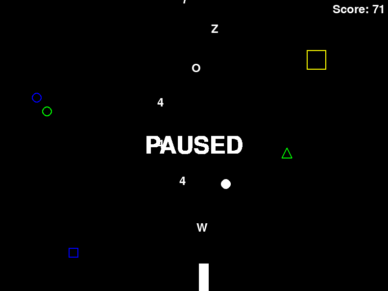

# Alphanumerical DRAWINATOR

Welcome to **DRAWINATOR**, a fun and engaging game where you shoot down enemies with alphanumeric bullets! This game is built using Python and the Pygame library.

## How to Play

Use the left and right arrow keys to move your gun. Press the space bar to shoot bullets. Each bullet is assigned a random character from alphanumericals.

When the game is paused, a "PAUSED" text will appear in the center of the screen. Press 'P' to pause and unpause the game.

## Features

- **Multishot**: After defeating a boss, you gain the ability to shoot multiple bullets at once for a short period of time.
- **Boss Enemies**: Occasionally, a boss enemy will appear. Boss enemies are larger and have more health than regular enemies.
- **Killer Enemies**: These enemies are dangerous! If they collide with your gun, the game ends.

## Installation

-Regular-

1. Download the latest release version
2. Run the artist.exe

-From the source code-

1. Clone this repository: `git clone https://github.com/MrCoolPotato/Drawinator.git`
2. Navigate to the project directory: `cd`
3. Install the required Python libraries: `pip install -r requirements.txt`
4. Run the game: `python artist.py`

## Requirements

(if you're running the source code)

- Python 3.6 or above
- Pygame 1.9.6 or above
